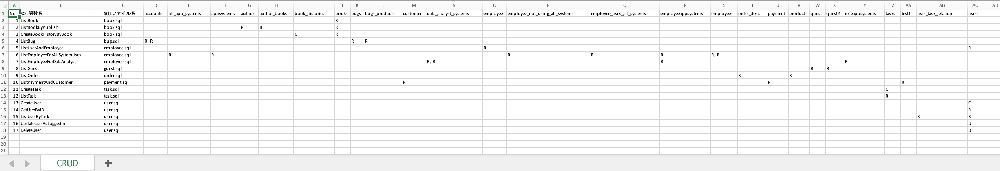

# kreu-crud-for-sqlc

This is a tool that reads SQL files for [sqlc](https://sqlc.dev/) and creates CRUD tables.

However, it is unfinished.

## What you need to use

- Install [docker](https://www.docker.com/)
- Environment in which make command can be used

## How does it work?

1. build

```
make build
```

2. prepare sql files

    like [this](./testdata)

3. run

※ `xxxx` is the directory where your SQL files are located.

```
make run DIR=/xxxx
```

After execution, a [CRUD.xlsx](./testdata/CRUD.xlsx) file is created under xxxx.

